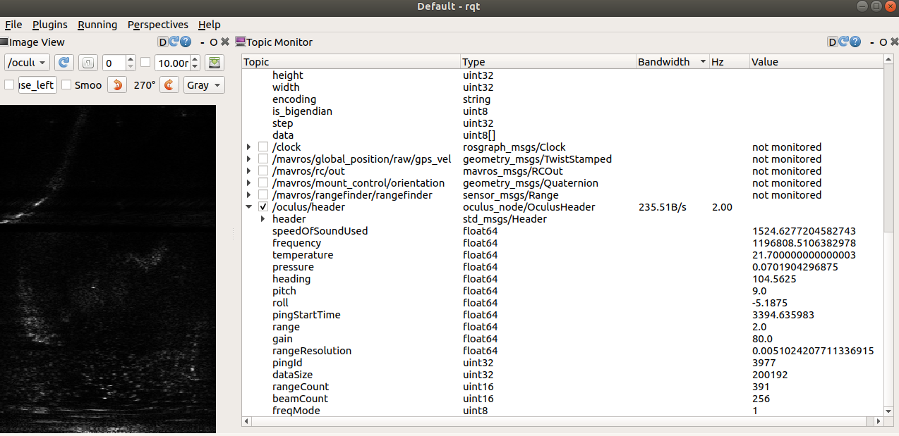

# Oculus Node
A node to interface with the Oculus M1200d, simultaneously logging data to binary files and publishing over a ROS network.

## Set Up
1. Install the Flinders University Oculus driver (stored on the Thales Bitbucket), using the following sequence of commands, where `project_dir` is the download location of the driver files.

```
cd project_dir && mkdir build && cd build && cmake .. && sudo make install
```

2. Create a catkin workspace and copy the contents of the `oculus_node` directory to `src`

3. Build with `catkin_make`

## Recording Data
The following steps are used to connect to the Oculus M1200d, mounted to the BlueROV2. The BlueROV2 is connected to the companion computer via the Fathom-X tether.

1. Power up the BlueROV2 and wait half a minute for initialisation to complete.

2. Start the Pi3 (companion computer) to Pi4 (sensor computer) bridge:
```
ssh pi@192.168.2.2 (pwd: companion)
nohup ./bridge_script.sh
./remove_eth0_route.sh
```

3. Start the Pi4 to Oculus bridge:
```
ssh thales@192.168.2.4 (pwd: Blutonomy@789)
nohup ./bridge_script.sh
./remove_eth0_route.sh
```

4. In another terminal, start roscore
```
roscore
```

5. In another terminal, start the Oculus node
```
cd {the workspace with this package}
source devel/setup.bash
rosrun oculus_node oculus_node
```

6. In another terminal, navigate to the directory where you would like to store the bagged data. Then execute:
```
rosbag record -a
```

## Viewing Data
The node will publish images on `/oculus/polarscan` and oculus header files on `/oculus/header`. Binary files will be logged to `configFileName`, defined around line 100 in `oculus_node.cpp`. The binary logging location can be modified by changing the file name and running `catkin_make` again.

Header and image files may be viewed in RQT. Remember to overlay the catkin workspace which the oculus_node package was built in before starting RQT.
```
source devel/setup.bash
rqt
```


The parameters in `config.json` can be configured on the fly to adjust scan settings. On saving the the file, new settings will take effect at the next packet request.

## Known Issues
- This node cannot be operated simultaneously with Oculus ViewPoint software.
- While theoretically possible, we have been unable to get this node to operate simultaneously with PingViewer reading from the Ping360 also on the BlueROV2.

## A note on message formats
During the first pool trial held on 16 November 2021, scans were recorded using an incorrect message format, where the `header` field was incorrectly capitalised as `Header`.

If encountering difficulty OculusHeader messages recorded on this date, the [bag migration](http://wiki.ros.org/rosbag/migration) rule `OculusHeaderRule.bmr` may need to be used to convert the bag to the present format.